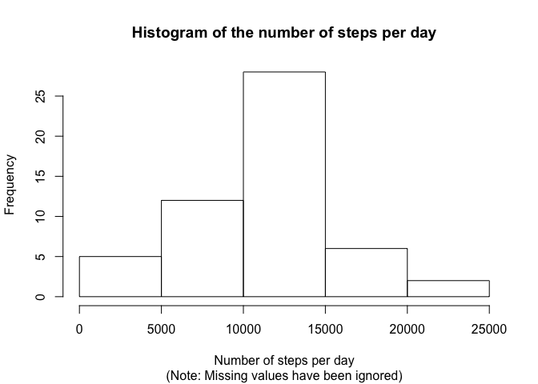
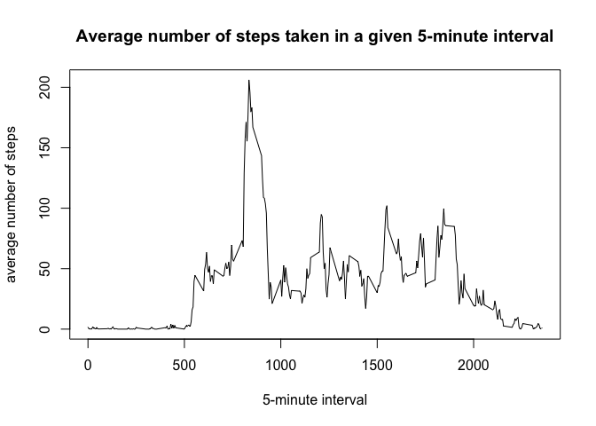
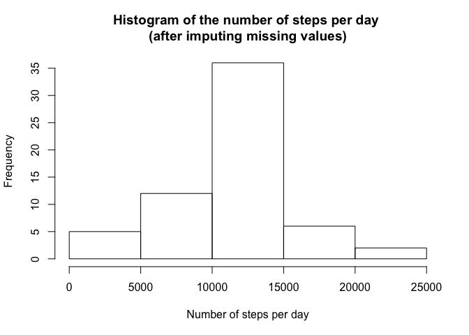
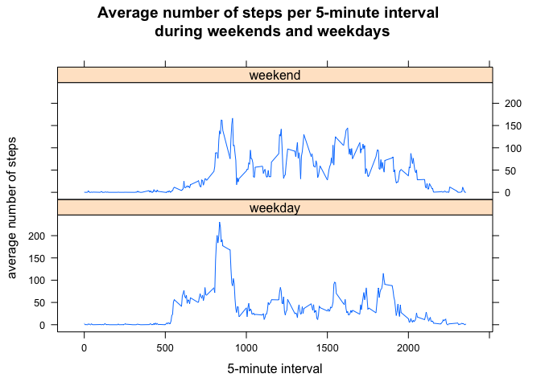

# Reproducible Research: Peer Assessment 1


## Loading and preprocessing the data

1. Loading the zip file as a data table


```r
library(data.table)
```

```
## Warning: package 'data.table' was built under R version 3.1.3
```

```r
dataFrame <- read.csv(unz("activity.zip", "activity.csv"))
data <- as.data.table(dataFrame)
```

2. Showing the header of this data table


```r
head(data)
```

```
##    steps       date interval
## 1:    NA 2012-10-01        0
## 2:    NA 2012-10-01        5
## 3:    NA 2012-10-01       10
## 4:    NA 2012-10-01       15
## 5:    NA 2012-10-01       20
## 6:    NA 2012-10-01       25
```


## What is mean total number of steps taken per day?

1. Calculating the total number of steps taken per day and storing the result


```r
# ignoring the missing values
dataWithoutMissingValues <- data[data[,!is.na(steps)],]
# calculating the total number of steps
totalNumberStepsPerDay <- dataWithoutMissingValues[,sum(steps, na.rm=TRUE),by=date]
# setting the column names of the variable 'totalNumberStepsPerDay' 
setnames(totalNumberStepsPerDay, c("date", "numberOfStepsPerDay"))
```

2. Making a histogram of the total number of steps taken each day


```r
library(graphics)
# calculating the histogram
hist(totalNumberStepsPerDay$numberOfStepsPerDay, 
     xlab = "Number of steps per day", 
     main = paste("Histogram of the number of steps per day"),
     sub = "(Note: Missing values have been ignored)")
```

 

3. Calculating and reporting the mean and the median of the total number of steps taken per day


```r
paste("Mean  = ", mean(totalNumberStepsPerDay$numberOfStepsPerDay))
```

```
## [1] "Mean  =  10766.1886792453"
```

```r
paste("Median =", median(totalNumberStepsPerDay$numberOfStepsPerDay))
```

```
## [1] "Median = 10765"
```

## What is the average daily activity pattern?

1. Calculating and plotting the average number of steps per 5-minute interval


```r
# calculating the average number of steps per 5-minute interval in a day
averageNumberStepsPer5minuteInteval <- data[,mean(steps, na.rm=TRUE),by=interval]
# setting the column names of the variable 'averageNumberStepsPer5minuteInteval' 
setnames(averageNumberStepsPer5minuteInteval, c("interval", "averageNumberOfSteps"))
# plotting the time series
plot(averageNumberStepsPer5minuteInteval$interval, 
     averageNumberStepsPer5minuteInteval$averageNumberOfSteps, 
     type="l",
     main="Average number of steps taken in a given 5-minute interval",
     xlab = "5-minute interval",
     ylab = "average number of steps")
```

 

2. Calculating the 5-minute interval with the maximum number of steps


```r
# retrieving the 5-minute interval with the maximum number of steps (averaged across all observations)
averageNumberStepsPer5minuteInteval[order(averageNumberOfSteps,decreasing=TRUE),][1]
```

```
##    interval averageNumberOfSteps
## 1:      835             206.1698
```


## Imputing missing values

1. Calculating the number of rows with missing values


```r
paste( "Number of rows with missing values = ", length(which(is.na(data$steps))))
```

```
## [1] "Number of rows with missing values =  2304"
```

2. Filling in the missing values with the average number of steps for their 5-minute interval, and storing the result in a new data table

```r
## making a copy of the data into the variable 'cleandata'
cleanData <- copy(data)
## replacing the NA values in 'cleandata' by the average steps for the respective 5-minute interval
for(i in 1:length(cleanData$steps)){
    if(is.na(cleanData$steps[i])){
        intervalWithMissingMeasurement <- cleanData$interval[i]
        cleanData$steps[i] <- 
            averageNumberStepsPer5minuteInteval[interval==intervalWithMissingMeasurement]$averageNumberOfSteps
    }    
}
```

3. Histogram of the total number of steps taken each day for the clean dataset


```r
# calculating the total number of steps per day for the clean dataset
totalNumberStepsPerDayCleanData <- cleanData[,sum(steps),by=date]
# setting the column names 
setnames(totalNumberStepsPerDayCleanData, c("date", "numberOfStepsPerDay"))
# calculating the histogram
hist(totalNumberStepsPerDayCleanData$numberOfStepsPerDay, 
     xlab = "Number of steps per day", 
     main = paste("Histogram of the number of steps per day \n(after imputing missing values)"))
```

 

4. Calculating and reporting the mean and the median of the total number of steps taken per day, based on the clean dataset


```r
paste("Mean clean dataset = ", mean(totalNumberStepsPerDayCleanData$numberOfStepsPerDay))
```

```
## [1] "Mean clean dataset =  10766.1886792453"
```

```r
paste("Median clean dataset =", median(totalNumberStepsPerDayCleanData$numberOfStepsPerDay))
```

```
## [1] "Median clean dataset = 10766.1886792453"
```


## Are there differences in activity patterns between weekdays and weekends?

1. Adding a new column in the clean data to indicate whether a given data is a weekday or weekend day


```r
## adding the new column 'weekPeriod'
cleanData[,weekPeriod:=weekdays(as.Date(cleanData$date))]
```

```
##            steps       date interval weekPeriod
##     1: 1.7169811 2012-10-01        0     Monday
##     2: 0.3396226 2012-10-01        5     Monday
##     3: 0.1320755 2012-10-01       10     Monday
##     4: 0.1509434 2012-10-01       15     Monday
##     5: 0.0754717 2012-10-01       20     Monday
##    ---                                         
## 17564: 4.6981132 2012-11-30     2335     Friday
## 17565: 3.3018868 2012-11-30     2340     Friday
## 17566: 0.6415094 2012-11-30     2345     Friday
## 17567: 0.2264151 2012-11-30     2350     Friday
## 17568: 1.0754717 2012-11-30     2355     Friday
```

```r
## setting the value of the column 'weekPeriod' to "weekend" or "weekday"
for(i in 1:length(cleanData$steps)){
    if(cleanData$weekPeriod[i] == "Saturday" || cleanData$weekPeriod[i] == "Sunday"){
        cleanData$weekPeriod[i] <- "weekend"
    } else{
        cleanData$weekPeriod[i] <- "weekday"
    }
}
```

2. Making a panel plot with the average number of steps in weekdays and weekends


```r
# calculating the average number of steps for a given the combinations (weekPeriod, 5-minute interval)
averageStepsPerWeekperiodAndInterval <- cleanData[,mean(steps, na.rm=TRUE),by=c("weekPeriod","interval")]
setnames(averageStepsPerWeekperiodAndInterval, c("weekPeriod", "interval", "averageNumberOfSteps"))

# Plotting the data in a panel xyplot
library(lattice)
xyplot(averageNumberOfSteps ~ interval | weekPeriod,
       data = averageStepsPerWeekperiodAndInterval,
       main="Average number of steps per 5-minute interval \n during weekends and weekdays",
       xlab = "5-minute interval",
       ylab = "average number of steps",
       panel = function(...) {
           panel.xyplot(type="l",...)
       },
       layout = c(1,2)
       )
```

 


Note that the individual walks more during the weekends!
